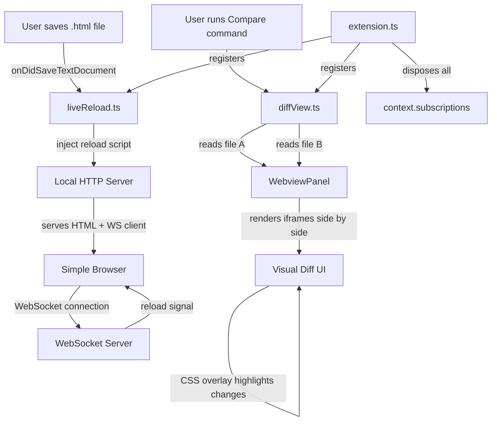

# Architecture Document: Live Reload + Multi-File Diff View
> Generated: 2026-05-11

## Overview & Context

ContextHTML is a VS Code/Cursor extension that auto-opens Simple Browser when an HTML file is opened. This document covers two planned features:

- **Live Reload** — automatically refreshes Simple Browser whenever an HTML file is saved, so AI-generated updates appear instantly without reopening the file
- **Multi-File Diff View** — renders two HTML files side-by-side in a WebviewPanel with visual highlighting of changed regions, useful for comparing agent-generated iterations

Both features extend the existing single-file extension (`src/extension.ts`) into a modular multi-file architecture.

## Current Architecture Diagnosis

The current extension is a single 45-line file with one responsibility: open Simple Browser when an HTML file is opened. Pain points relevant to these new features:

- **`file://` URI limitation** — Simple Browser loads files via `file://`, which blocks WebSocket connections needed for live reload. A local HTTP server must replace direct file serving.
- **No module separation** — all logic lives in `extension.ts`. Adding live reload and diff view here would make it unmanageable. Needs decomposition before these features land.
- **No server lifecycle management** — the extension currently creates no long-lived resources. Both new features require servers and panels that must be properly disposed.

## Ideal End State

```
src/
  extension.ts      — activation, wires up all modules
  liveReload.ts     — HTTP server + WebSocket server + save listener
  diffView.ts       — WebviewPanel + HTML comparison renderer
```

- Opening an HTML file auto-opens Simple Browser (existing behavior, now served via localhost)
- Saving the file triggers an instant browser refresh via WebSocket — no manual reload
- Running `ContextHTML: Compare HTML Files` opens a split WebviewPanel showing two HTML files rendered side-by-side with visual diff overlay

## The Commandments

1. **Event-driven over polling** — use `onDidSaveTextDocument` for live reload, never `setInterval`. VS Code already emits save events; polling wastes CPU.
2. **Simple Browser is the display layer, not the logic layer** — inject a `<script>` tag into the served HTML for WebSocket reload; never try to control Simple Browser's internals directly.
3. **Serve locally, don't use `file://` for live reload** — a minimal Node `http` server serves HTML so the injected reload script can use WebSockets. `file://` URLs block WebSocket connections.
4. **Diff is visual, not textual** — the diff view renders two HTML files in side-by-side iframes inside a WebviewPanel with a CSS overlay. We compare rendered output, not raw markup.
5. **Each feature is a separate module** — `liveReload.ts` and `diffView.ts` are independent. Neither knows about the other.
6. **No external runtime dependencies** — use only Node built-ins (`http`, `crypto`) and the VS Code API. No Express, no chokidar, no diff libraries in the VSIX.
7. **Graceful cleanup** — every server, watcher, and WebviewPanel is disposed via `context.subscriptions` on deactivation or file close.
8. **User-facing commands for explicit actions** — live reload activates automatically on save; diff view requires explicit command palette invocation (`ContextHTML: Compare HTML Files`) since it needs two files selected.

## Design Choices & Trade-offs

### Live Reload: WebSocket vs. polling

- **Chosen:** WebSocket server (Node `http` + manual WebSocket upgrade handshake using `crypto` for the RFC 6455 handshake)
- **Alternatives considered:** `EventSource` (SSE) — simpler but one-directional and less universally supported in webviews; meta-refresh tag — crude, causes full page flash
- **Rationale:** WebSocket gives instant push with no flash. Node's `http` module supports upgrade events natively — no external dependency needed.
- **Pros:** Instant reload, no polling overhead, no extra packages
- **Cons:** Requires implementing the WebSocket handshake manually (~30 lines); needs a free port

### Live Reload: Port allocation

- **Chosen:** Find a free port dynamically by binding to port 0 and reading the assigned port
- **Alternatives considered:** Fixed port (e.g. 7331) — risks conflicts with other tools
- **Rationale:** Dynamic allocation is collision-free with zero config
- **Pros:** Always works, no user configuration needed
- **Cons:** Port changes on each activation (irrelevant since URL is injected dynamically)

### Diff View: WebviewPanel vs. two Simple Browser instances

- **Chosen:** Single `WebviewPanel` rendering both files in iframes side by side
- **Alternatives considered:** Two Simple Browser panels — no way to synchronize scroll or overlay a diff; external diff tool — leaves the editor
- **Rationale:** A WebviewPanel gives full control over layout, scroll sync, and overlay rendering
- **Pros:** Scroll sync, visual diff overlay, stays in editor, fully controllable
- **Cons:** iframes with `file://` src are blocked by webview CSP — files must be read with `fs.readFileSync` and inlined as `srcdoc` blobs

### Diff View: How to detect visual differences

- **Chosen:** Inject a `MutationObserver` + element bounding-box comparison script that runs after both iframes load, highlights elements whose bounding boxes differ between the two renders
- **Alternatives considered:** HTML string diff (highlight changed tags) — doesn't reflect visual impact; pixel-level screenshot diff — not available in a webview without a headless browser
- **Rationale:** Bounding-box comparison is a good proxy for visual change and is achievable purely in browser JS with no dependencies
- **Pros:** No deps, reflects layout changes, works on dynamically rendered content
- **Cons:** Won't catch purely stylistic changes (e.g. color changes that don't affect layout)

## Migration Path

1. Refactor `extension.ts` — extract open-on-file logic into a `registerOpenListener()` function, keep `activate()` as the wiring point
2. Build `liveReload.ts` — HTTP server that reads and serves the current HTML file with an injected WebSocket reload script; WebSocket server on the same port via the `upgrade` event; `onDidSaveTextDocument` listener that broadcasts a reload signal to all connected clients
3. Update `extension.ts` to start the live reload server on activation and dispose it on deactivation
4. Update `simpleBrowser.show` call to use `http://localhost:<port>/` instead of the `file://` URI
5. Build `diffView.ts` — command handler for `contexthtml.compareFiles`; quick-pick to select two HTML files; WebviewPanel that inlines both files as `srcdoc` iframes; injected scroll-sync and bounding-box diff overlay script
6. Register the `contexthtml.compareFiles` command in `extension.ts` and declare it in `package.json`
7. Republish as v2.0.0

## Architecture Diagram



[Open in Mermaid Live](https://mermaid.live/edit#base64:eyJjb2RlIjoiZmxvd2NoYXJ0IFRECiAgICBBW1VzZXIgc2F2ZXMgLmh0bWwgZmlsZV0gLS0+fG9uRGlkU2F2ZVRleHREb2N1bWVudHwgQltsaXZlUmVsb2FkLnRzXQogICAgQiAtLT58aW5qZWN0IHJlbG9hZCBzY3JpcHR8IENbTG9jYWwgSFRUUCBTZXJ2ZXJdCiAgICBDIC0tPnxzZXJ2ZXMgSFRNTCArIFdTIGNsaWVudHwgRFtTaW1wbGUgQnJvd3Nlcl0KICAgIEQgLS0+fFdlYlNvY2tldCBjb25uZWN0aW9ufCBFW1dlYlNvY2tldCBTZXJ2ZXJdCiAgICBFIC0tPnxyZWxvYWQgc2lnbmFsfCBECgogICAgRltVc2VyIHJ1bnMgQ29tcGFyZSBjb21tYW5kXSAtLT4gR1tkaWZmVmlldy50c10KICAgIEcgLS0+fHJlYWRzIGZpbGUgQXwgSFtXZWJ2aWV3UGFuZWxdCiAgICBHIC0tPnxyZWFkcyBmaWxlIEJ8IEgKICAgIEggLS0+fHJlbmRlcnMgaWZyYW1lcyBzaWRlIGJ5IHNpZGV8IElbVmlzdWFsIERpZmYgVUldCiAgICBJIC0tPnxDU1Mgb3ZlcmxheSBoaWdobGlnaHRzIGNoYW5nZXN8IEkKCiAgICBKW2V4dGVuc2lvbi50c10gLS0+fHJlZ2lzdGVyc3wgQgogICAgSiAtLT58cmVnaXN0ZXJzfCBHCiAgICBKIC0tPnxkaXNwb3NlcyBhbGx8IEtbY29udGV4dC5zdWJzY3JpcHRpb25zXSIsIm1lcm1haWQiOnsidGhlbWUiOiJkZWZhdWx0In19)

## Expected Performance

| Metric | Target | Rationale |
|--------|--------|-----------|
| Live reload latency (save → browser refresh) | < 100ms | WebSocket push is near-instant; file read + HTTP serve is the only overhead |
| Diff view open time | < 500ms | Two `fs.readFileSync` calls + WebviewPanel creation; both files are small HTML |
| Memory per active server | < 5MB | Single Node HTTP server with no state beyond connected WebSocket clients |
| Concurrent HTML files with live reload | 1 (per window) | One server instance tracks the most recently opened HTML file; multi-file tracking is out of scope |
| VSIX size impact | < 10KB added | No new runtime deps; only additional TS source files |
